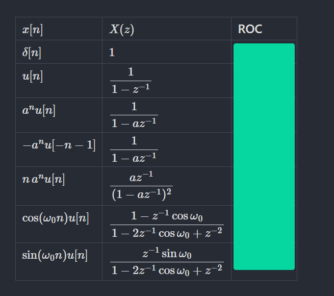
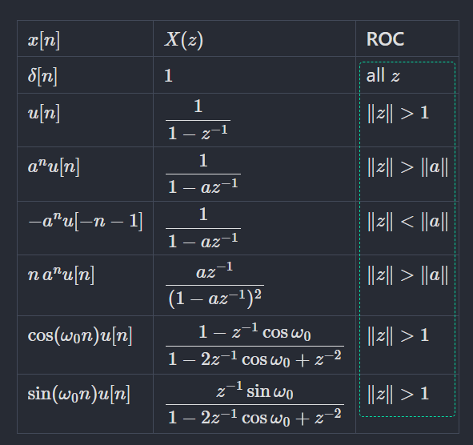

# Note Occlusion for Obsidian

Paint coloured covers over any part of a note, then click them to reveal what
is underneath. Each note keeps its own covers, and they come back every time
you open it.

This is the Obsidian port of the desktop Overlay Colors tool. The desktop
version paints over the whole screen; this one paints over the note itself, so
the covers scroll with the text, survive a restart, and follow the note when
you rename or move it.

> **Markdown notes only.** This plugin does not work on PDFs, Canvas files,
> images, or anything else that isn't a markdown note. See
> [Markdown notes only](#markdown-notes-only) below for why, and for pointers
> to plugins that do handle PDFs.

## Install

Copy `main.js`, `manifest.json`, and `styles.css` into:

```
<your vault>/.obsidian/plugins/note-occlusion/
```

Then enable **Note Occlusion** in Settings, Community plugins. Restart Obsidian
if it does not appear straight away.

## Five modes

| Mode | What the mouse does |
|---|---|
| **Draw** | Drag on the note to paint a cover. Drag a cover to move it, drag a grip to resize, right-click for colour, bring-to-front, or delete. The note is not editable while this is on. |
| **Text** | Select text to hide it. These covers are anchored to the selected words and are recalculated when you switch between Reading and editing modes. |
| **Delete** | Right-click a cover to remove it immediately, no menu. This is the same delete action available from Draw mode's right-click menu, just one click instead of two. The note is not editable while this is on. |
| **Reveal** | Click a cover to show what is under it. Click again to hide it. Everything else in the note works normally. |
| **Pass** | Covers stay visible but ignore the mouse entirely, so you can select and edit text through them. |

Switch modes from the toolbar, from the status bar item, or with the
**Cycle mode** command. Escape leaves Draw, Text, or Delete mode back to Reveal.
There are no default hotkeys, because single letters would be typed into your
notes. Assign your own under Settings, Hotkeys, searching for "Occlusion".

A delete, wherever it happens, goes through the same undo history as every
other change, so **Undo** brings back a cover removed by accident.

## Getting started

1. Open a note and click the ribbon icon to show the toolbar.
2. Switch to **Text** and select the words you want to hide, or use **Draw** for a free-form box.
3. Switch to **Reveal** and click it. That is your flashcard.
4. Close the note, reopen it, restart Obsidian: the covers are still there.

**Hide every cover** resets a note for another pass, which is the study loop
this is built for. It has a command, so you can put it on a hotkey.

## Before and after

<!--
  Add two screenshots of the same note: once with no covers, once after
  drawing a few. Drop the image files in a screenshots/ folder at the repo
  root and point the paths below at them.
-->

| Before | After |
|---|---|
|  |  |

## Where the covers live

In the plugin's own `data.json`, under
`.obsidian/plugins/note-occlusion/data.json`, keyed by note path. Nothing is
written into your notes, so the markdown stays clean and no frontmatter is
added.

Consequences worth knowing:

- Renaming or moving a note keeps its covers. Moving a whole folder works too.
- Deleting a note deletes its covers.
- The file is inside `.obsidian`, so covers sync only if you sync that folder.
- If a note is edited outside Obsidian and its path changes, the covers are
  orphaned. Settings has a **Remove orphans** button for that.

## How positions are anchored

A drawn cover's horizontal position and width are stored as a fraction of the
note's content width, and its vertical position in pixels from the top of the content.

That means covers hold their place when you resize the pane or the window,
change the reading width, or scroll.

It does **not** mean drawn covers survive switching between Reading mode and Live
Preview / Source mode. Obsidian renders the same note through two different
engines for those - CodeMirror for editing, the markdown renderer for reading -
and they don't produce the same line heights, heading sizes, or block spacing
for identical text. A cover's vertical position is a fixed pixel distance from
the top of whichever one is currently on screen, so a cover positioned in one
mode is not guaranteed to land over the same content in the other.

Text covers avoid this problem: they store the selected text and nearby context,
then find those words again in the current renderer. Use **Text** mode when a
cover must follow content between Reading and editing modes. If the selected
words themselves are edited or deleted, that text cover cannot be located until
the original words exist again.

Drawn covers are anchored to a **position**, not to the words under them.
If you add or remove text above a cover, the text moves and the cover does not.
For a note you are actively writing, cover it after the text settles. Dragging a
cover back into place takes a second, and Undo is available if you overshoot.

## Settings

- Cover colour for new covers, plus the swatch list used by the toolbar and the
  right-click menu.
- Mode when Obsidian starts. **Reveal** is the default so the plugin never
  blocks typing unexpectedly.
- Cover opacity. Below 1 the text shows through faintly, which is useful for
  "almost remembered it" review.
- Outline revealed covers, so you can find and re-hide a cover you opened.

## Markdown notes only

Covers only appear on markdown notes. Opening a PDF, a Canvas file, an image,
or any other non-markdown view and expecting covers to work there won't do
anything, silently.

This isn't a missing checkbox, it's a limit of the plugin API. Obsidian's PDF
viewer (and Canvas, and image views) is a different kind of view entirely,
rendered by PDF.js onto canvases that Obsidian creates and destroys as you
scroll, with no equivalent of a note's stable content element to anchor a
cover's position against. There's no public API into that viewer. The plugins
that do overlay PDFs, like [PDF++](https://github.com/ryotaushio/obsidian-pdf-plus),
say as much themselves: they rely on private, undocumented internals that can
break on any Obsidian update. That's a different engineering commitment than
this plugin makes, so it's out of scope here rather than done unreliably.

If what you actually want is to occlude or annotate PDFs, look at
[PDF++](https://github.com/ryotaushio/obsidian-pdf-plus),
[Study PDF](https://www.obsidianstats.com/plugins/study-pdf), or
[Local PDF Annotator](https://www.obsidianstats.com/plugins/local-pdf-annotator)
instead. They're built against the PDF viewer specifically.

## Similar plugins

Occlusion-style studying isn't a new idea, and this isn't the only Obsidian
plugin doing it. Worth knowing what else is out there before you settle on
one:

- **[Masking Type](https://community.obsidian.md/plugins/masking-type)** is
  the closest match by maturity. It hides bold, italic, and highlighted text
  and reveals it on click, configured per note through a frontmatter property.
  The mechanism is different: it masks markdown formatting you've already
  written, rather than a rectangle you draw freely over the rendered note.
- **[Slide and Reveal](https://community.obsidian.md/plugins/slide-and-reveal)**
  is the closest match by mechanism - coloured covers, groups, click or scroll
  to reveal - but it works on images you export into a dedicated folder view,
  not on a note's live text.
- **Anki Flashcard Sync** supports image occlusion cards, but syncs them out
  to Anki rather than making them interactive inside Obsidian.

What this plugin does that those don't: draw a cover directly over live note
text with no pre-formatting and no export step, anchored per note the same
way the desktop Overlay Colors app worked. Whether that's reason enough to
run this instead of an established plugin is a judgment call, not something
a README can settle for you.

## Development

```bash
npm install
npm run dev     # watch build
npm run build   # typecheck, then a production main.js
npm run test    # store and persistence checks
```

`src/types.ts` holds the geometry helpers ported from the Python `models.py`.
They were checked case by case against the original: 40 resize cases, 8 handle
anchors, and the contrast-colour rule all produce identical numbers.
